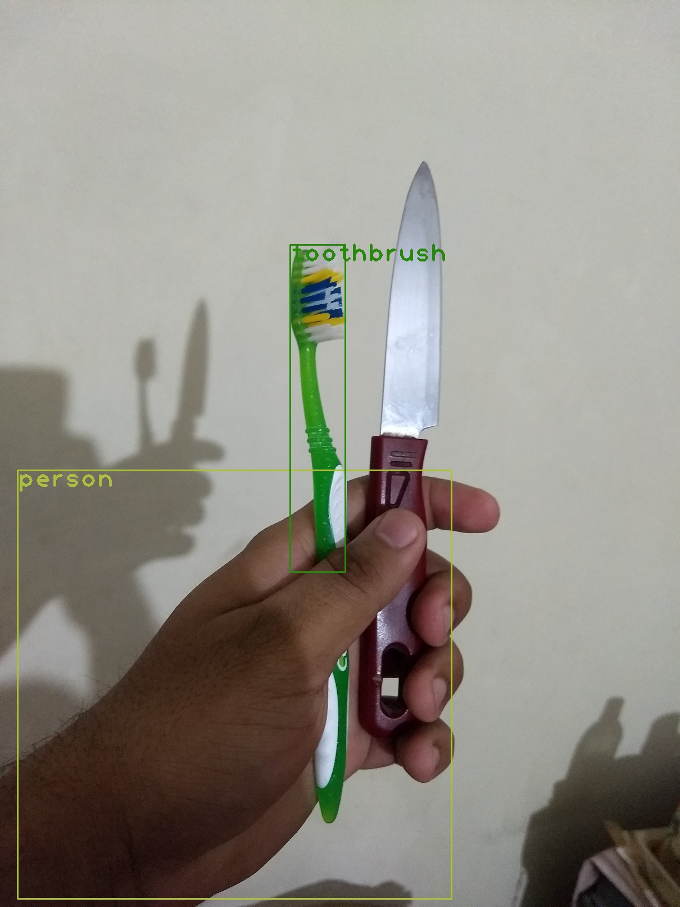

# YoloV3 n YoloV4
________
OpenCV YoloV3: [SOURCE ](https://pysource.com/2019/06/27/yolo-object-detection-using-opencv-with-python/)

1. Run this above code on your laptop or Colab. 
2. Take an image of yourself, holding another object which is there in COCO data set 
3. Run this image through the code above.



---

Yolo V3 Simplified for training on Colab with custom data-set. 

Full credit goes to [this](https://github.com/theschoolofai/YoloV3) and [this](https://github.com/ultralytics/yolov3), and if you are looking for much more detailed explanation and features, please refer to the original [source](https://github.com/ultralytics/yolov3). 

You'll need to download the weights from the original source. 
1. Create a folder called weights in the root (YoloV3) folder
2. Download from: https://drive.google.com/open?id=1LezFG5g3BCW6iYaV89B2i64cqEUZD7e0
3. Place 'yolov3-spp-ultralytics.pt' file in the weights folder:
  * to save time, move the file from the above link to your GDrive
  * then drag and drop from your GDrive opened in Colab to weights folder

For custom dataset:
1. Clone this repo: https://github.com/miki998/YoloV3_Annotation_Tool
2. Follow the installation steps as mentioned in the repo. 
3. Download images of your unique object classes. 
4. Annotate the images using the Annotation tool. 
```
data
  --customdata
    --images/
      --img001.jpg
      --img002.jpg
      --...
    --labels/
      --img001.txt
      --img002.txt
      --...
    custom.data #data file
    custom.names #your class names
    custom.txt #list of name of the images you want your network to be trained on.
    custom.shapes #sizes of the images used train/test
Currently we are using same file for test/train (makes seperate train n test accordingly)
```
5. As you can see above you need to create **custom.data** file. 
```
  classes=4 (as in our case [hardhat, vest, mask, boots])
  train=data/customdata/custom.txt
  test=data/customdata/custom.txt 
  names=data/customdata/custom.names
```
6. Keeps the path convention proper as mentioned. This is how our train.txt / test.txt file looks like (please note the .s and /s):
```
./data/customdata/images/img001.jpg
./data/customdata/images/img002.jpg
./data/customdata/images/img003.jpg
...
```
7. You need to add custom.names file as you can see above. Our custom.names file look like this:
```
hardhat
vest
mask
boots
```
8. hardhat above will have a class index of 0 and so on. 
9. For COCO's 80 classes, VOLOv3's output vector has 255 dimensions ( (4+1+80)*3). Now we have 4 class, so we would need to change it's architecture.
10. Copy the contents of 'yolov3-spp.cfg' file to a new file called 'yolov3-custom.cfg' file in the data/cfg folder. 
11. Search for 'filters=255' and change all three entries. Change 255 to 27 = (4+1+4)*3
12. Search for 'classes=80' and change all three entries to 'classes=4'
13. Since i was lazy,and working with very few samples. In such a case it is a good idea to change:
  * burn_in to 100
  * max_batches to 5000
  * steps to 4000,4500
14. Don't forget to perform the weight file steps mentioned in the section above. 
15. Run this command `python train.py --data data/customdata/custom.data --batch 10 --cache --cfg cfg/yolov3-custom.cfg --epochs 3 --nosave`

16. Download a very small (~10-30 sec) video from you tube which shows your classes. 
17. Use [ffmpeg ](https://en.wikibooks.org/wiki/FFMPEG_An_Intermediate_Guide/image_sequence)to extract frames from the video. 
18. Upload on your drive (alternatively you could be doing all of this on your drive to save upload time)
19. Infer on these images using detect.py file.
20. Modify detect.py  file if your file names do not match the ones mentioned on GitHub. 
21. python detect.py --conf-thres 0.3 -- source input_folder_name --output output_folder_name
22. Use [ffmpeg ](https://en.wikibooks.org/wiki/FFMPEG_An_Intermediate_Guide/image_sequence) to convert the files in your output folder to video.

**Results**
After training for 300 Epochs, results look awesome!

[Custom dataset](https://drive.google.com/file/d/1wco-H1x3i1Ew8SFzfoqX5YGXMc4fMAkz/view?usp=sharing)

[YOLOv3 video output](https://youtu.be/UHn-J94Pil4)

---

## YOLO v4

[YoloV4 Training on Colab!](https://colab.research.google.com/drive/1b08y_nUYv5UtDY211NFfINY7Hy_pgZDt#scrollTo=1YW7jPF1BOAw)

Follow the code in colab file to train YOLOv4 on your own custom dataset.

Use [ROBOFLOW](https://app.roboflow.com/) to make YOLOv4 pytorch supported dataset. This allows us to make augemented images as well. Used Blur and Exposure.


